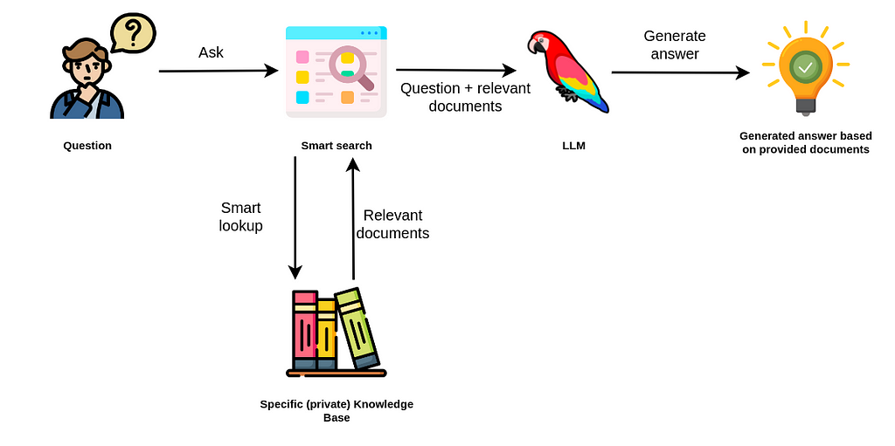

# 🧪 LLM_Response_with_Image_Reference
LLM will response with images not just text for enhnaced experience

*****
**🌍 Automation_Process **
1. Prep knowledge data
2. Create embedding
3. Similarity search
4. Retrieval augmented generation (RAG)
5. Deploy
6. No code alternatives

*****



## 🌐 How to run?
### STEPS:

Clone the repository

```bash
https://github.com/AleemAhmedKhan/GPT_with_Business_Specific_knowledge.git
```
### 💽  STEP 01- Create a conda environment after opening the repository
    
```bash
conda create -n LLM python=3.8 -y
```

```bash
conda activate LLM
```


###  🔍 STEP 02- install the requirements
```bash
pip install -r requirements.txt
```


```bash
# Finally run the following command
python app.py
```

Now,
```bash
open up you local host and port
```


## 📡 CICD-Deployment-with-Github-Actions

## 🛠 Deployment Steps:

1. Build the Docker image of the Source Code
2. Push the Docker image to Container Registry
3. Launch the Web App Server in Azure 
4. Pull the Docker image from the container registry to Web App server and run 
